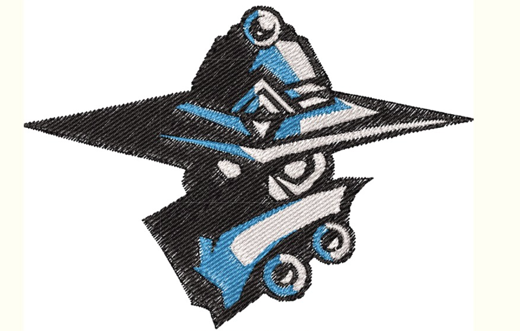
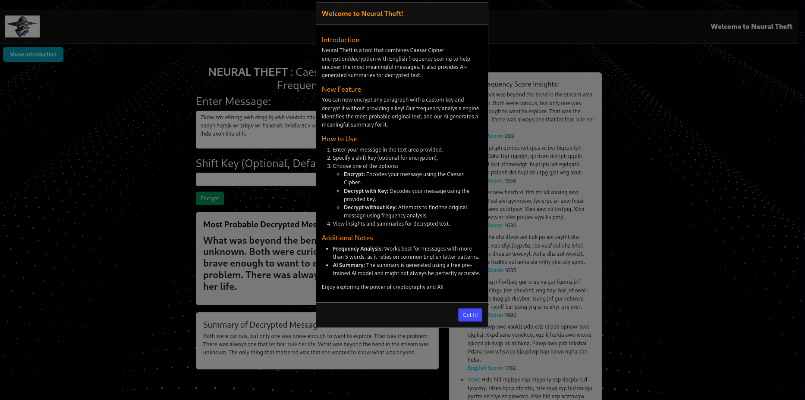
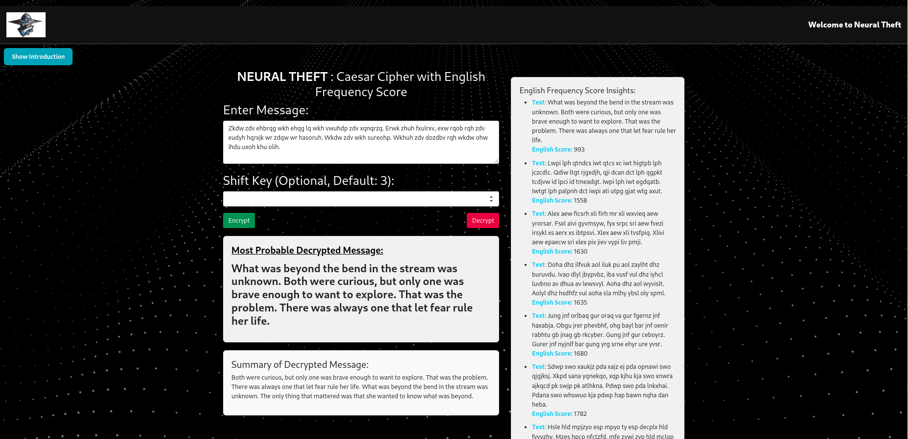

Neural Theft: AI-Powered Caesar Cipher Decryption System
========================================================

📜 Project Overview
-------------------

**Neural Theft** is a cutting-edge decryption tool that combines traditional cryptography with modern AI to decipher Caesar Cipher-encrypted messages. It uses natural language processing (NLP) and an advanced language model (LLM) to analyze possible decrypted texts, select the most meaningful one, and extract insights. Additionally, a chatbot built using **Botpress** helps explain the decryption results in a user-friendly way.

✨ Features
----------

*   **Automatic Decryption**: Detect the correct Caesar Cipher key using probability rules and LLM assistance.
*   **LLM Integration**: Analyze decrypted messages for meaningful context.
*   **Customizable Keys**: Provide your own key or let the system brute-force all possible keys.
*   **AI-Powered Chatbot**: A Botpress chatbot explains the decryption and insights from the text.
*   **Open-Source Friendly**: Built using free and open-source tools and dependencies.

🛠 Technologies Used
--------------------

*   **Programming Languages**: Python, JavaScript
*   **Cryptography**: Caesar Cipher (Reverse Engineering)
*   **NLP & AI**: Open-source LLM (e.g., Hugging Face Transformers)

*   **Deployment**: Free and open-source tools

🚀 How It Works
---------------

1.  **Input**: The user provides an encrypted message.
2.  **Decryption**:
    *   If a key is provided, decrypt using it.
    *   Otherwise, brute-force all possible keys.
3.  **Analysis**: LLM selects the most meaningful decrypted text using English probability rules.
4.  **Chatbot**: Displays and explains the decrypted message's meaning.
5.  **Output**: A clear and concise explanation of the original text and its context.

📦 Project Setup
----------------

### Clone the Repository

    git clone https://github.com/swimanonymous/neural-theft.git
    cd neural-theft
        

### Install Dependencies(this is complete resources you can skip this step directly run the project and install pakages as required manully --> for windows user , terminal will show you required projects needed so you can install using (pip install ame) cause many pakages are not available in windows so might get an error while installing req.txt

*   **Python Packages**:
    
        pip install -r requirements.txt --no-deps --ignore-requires-python
    

### Run the Project

1.  Start the decryption tool:
    
        python app.py
    
2.  browse (localhost:5000)
    
   
    

🖥 Demo
-------

Above is an illustration of how the decryption process works, from the encrypted message input to the chatbot explanation of the decrypted message.

📂 Folder Structure
-------------------

    neural-theft/
    │
    ├── static/              # Static files (images, styles)
    │   └── images/          # Images folder
    │       └── logo.png     # Logo file
    │
    ├── templates/           # HTML templates
    │   └── index.html       # Main page of the project
    │
    ├── LICENSE              # Project license
    ├── README.md            # Project documentation (this file)
    ├── app.py               # Main application logic
    └── requirements.txt     # Python dependencies
        

👥 Contributors
---------------

*   **sahil kadam**: [GitHub Profile](https://github.com/swimanonymous)
*   Open for contributions! Feel free to fork and create pull requests.

📜 License
----------

This project is licensed under the MIT License. See the `LICENSE` file for details.

🙌 Acknowledgments
------------------

*   [Hugging Face](https://huggingface.co/) for open-source NLP models.

Above is an example of how the Caesar Cipher works with a simple encrypted message, showing the process from encryption to decryption.
